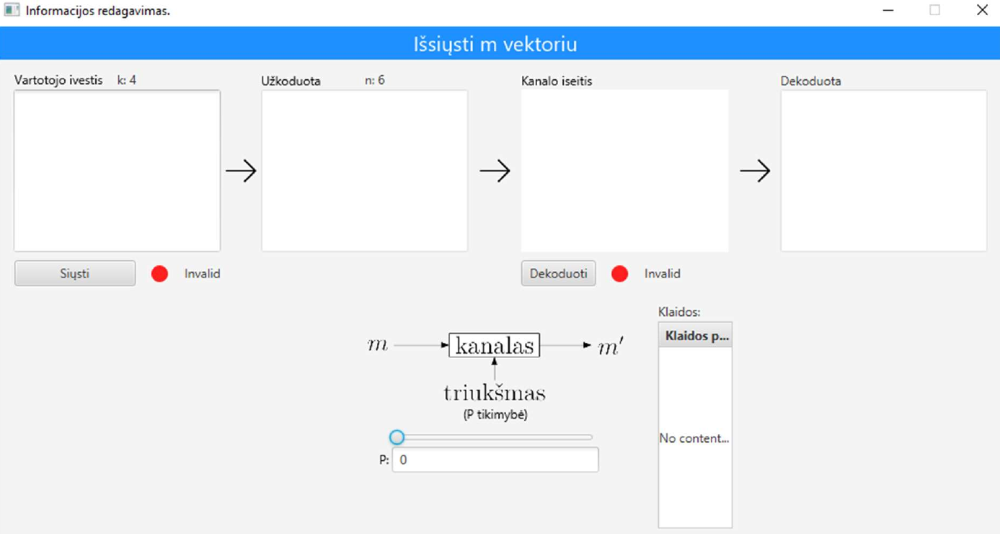
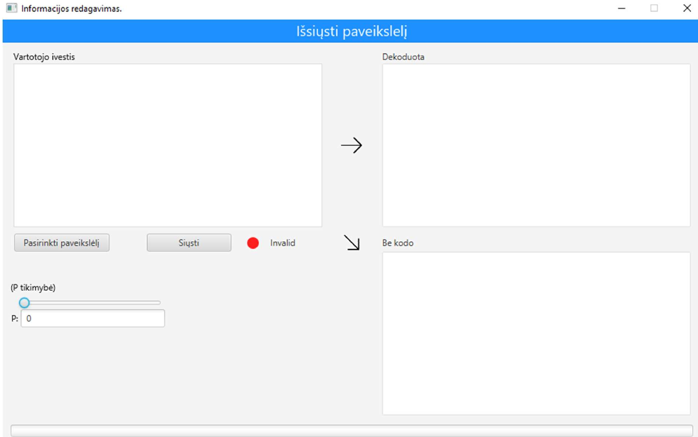

This application is designed to help users understand how encoding, sending and
decoding works using matrices.

Below you can find screenshots of binary message and image sending/receiving GUI"

For more detailed information see the final report: [ataskaita.pdf](ataskaita.pdf).  
Experiment data and raw measurements are available here: [eksperimentai.pdf](eksperimentai.pdf).